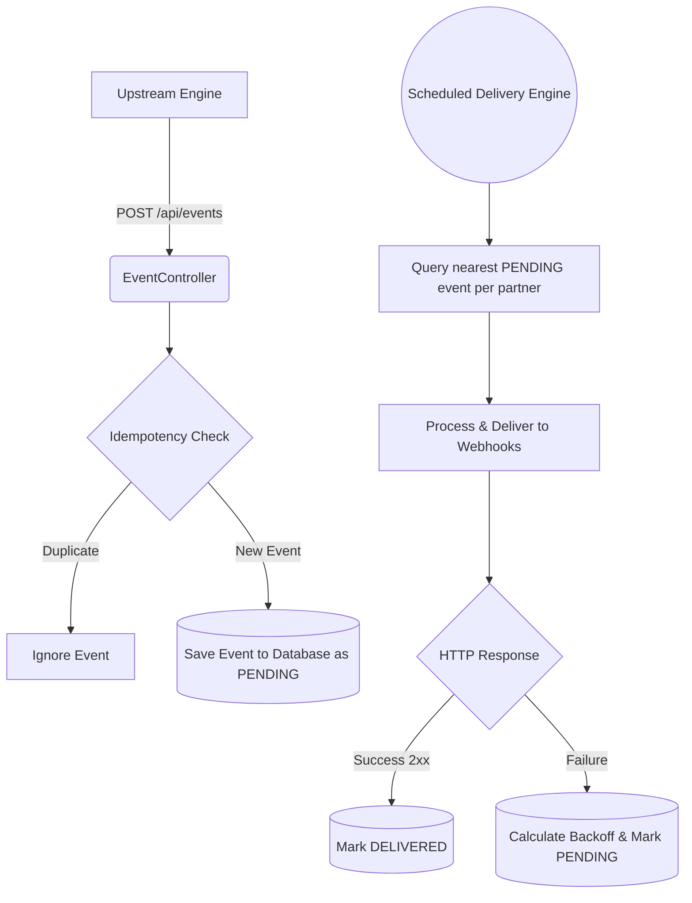

# Design Document 

This document breaks down the design decisions, trade-offs, and architecture I went with to solve the Webhook Delivery Service challenge within the time constraints of the assessment.

## High-Level Architecture

## 1. Data Model
I kept the data model relational and simple, prioritizing data integrity by using MySQL as my single source of truth. 

**Entities I created:**
- `Partner`: Stores the user's `partnerId` and their destination `webhookUrl`.
- `WebhookEvent`: The core table. Tracks the current status (`PENDING`, `PROCESSING`, `DELIVERED`, `FAILED`), the sequence number, and the `nextRetryAt` timestamp.
- `DeliveryAttempt`: A history log to track exact HTTP status codes, response times, and error messages for every single time we try to ping the partner.

*Decision:* I consciously chose to store the queue inside MySQL rather than introducing a separate message broker like RabbitMQ or Kafka. For this specific scope, MySQL is perfectly reliable as a queue backing store when properly indexed.

## 2. Idempotency & Validation
If the upstream screening engine accidentally double-sends a transaction event, we shouldn't spam the partner. 

To solve this, I generate a deterministic `eventId` by concatenating the format `transactionId-partnerId-eventType`. This guarantees uniqueness and is stored with a unique database constraint. If a duplicate comes in, it's immediately accepted to satisfy the upstream engine, but ignored internally without duplicating delivery.

*Extra Validation:* I also added strict state-machine validation on the API side. If the engine tries to submit a `TXN_RELEASED` event, my API immediately checks the database to ensure a `TXN_BLOCKED` event already existed previously for that exact transaction. If not, it safely rejects it.

## 3. Per-Partner Strict Ordering
The requirement was strict: events for a specific partner must be delivered sequentially. Event 2 cannot arrive before Event 1.

I solved this by assigning an incrementing `sequenceNumber` to every ingested event per partner. My `@Scheduled` delivery engine runs on a fast repeating loop and queries the database for the *single oldest pending event* for each partner.

To keep the system straightforward, simple, and easy to debug, the code relies on a procedural execution flow rather than complex thread pools. A single worker loops through all active partners with pending events, inherently guaranteeing perfect sequential delivery for each partner based on their assigned number.

## 4. Retry Strategy
I implemented an exponential backoff strategy for reliability. 

If an endpoint returns an error or times out, the event's `nextRetryAt` timestamp is pushed into the future. My chosen schedule is:
- Immediate (0s)
- 10 seconds
- 30 seconds
- 2 minutes
- 10 minutes

After 5 attempts, the event is marked `FAILED` permanently so it stops clogging the partner's queue queue.

## 5. Crash Recovery
A major edge case I accounted for: *What happens if my server loses power exactly while an HTTP request is actively in flight to a partner?* 

In that scenario, the database would think the event is forever stuck in the `PROCESSING` state. To fix this, I wrote an `@EventListener(ApplicationReadyEvent.class)` that runs the exact second the Spring Boot server boots up. It essentially runs a cleanup sweep: it looks for any zombie `PROCESSING` events left over from the crash and resets them back to `PENDING` so the delivery engine can safely pick them up again.

## 6. How I would scale this further (Trade-offs)
Because I had limited time to build this, I heavily prioritized core reliability and ordering over infinite throughput. 

If this were migrating into a high-scale production environment pushing thousands of events per second, I would actively make the following architectural changes:
1. **Drop the DB Polling**: Polling a MySQL index every 200ms becomes slow at scale. I would offload ingestion into **Kafka** topics (partitioned by `partnerId` to mathematically guarantee perfect ordering without database locks). 
2. **Use Redis**: I would utilize a Redis Sorted Set for the delayed retry queues instead of relying purely on SQL timestamps. 
3. **Adopt WebClient**: I would swap out `RestTemplate` for Spring WebFlux's fully non-blocking `WebClient` to ensure my thread pool doesn't get bottlenecked waiting for slow partner endpoints to respond.
