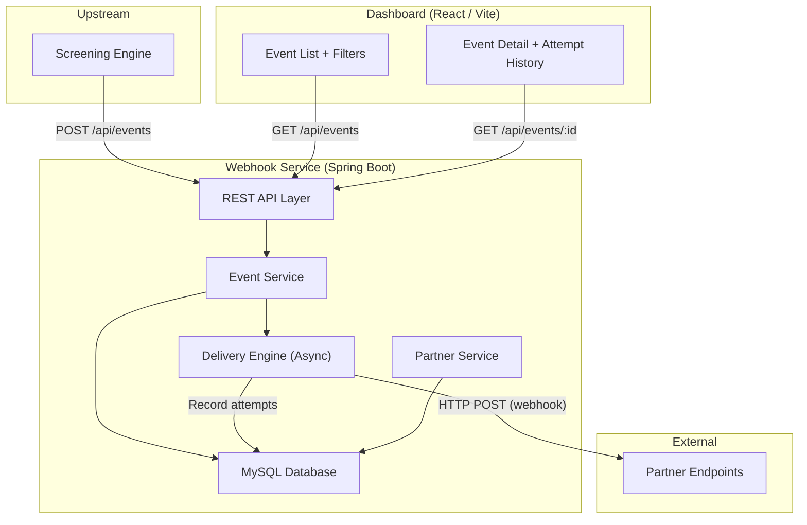
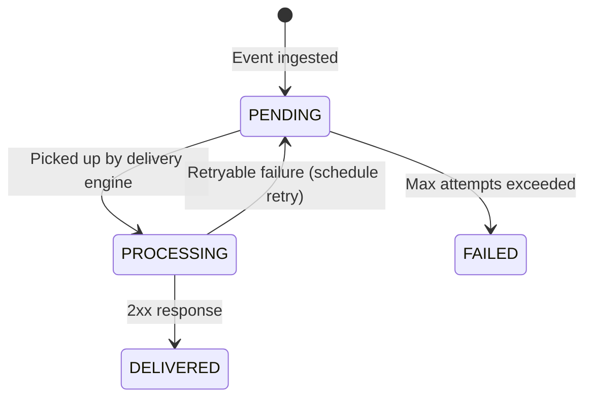

# Webhook Delivery Service — Implementation Plan

## Background

Build a **webhook delivery service** for a financial transaction screening platform. The service accepts events from an upstream screening engine and delivers them reliably to partner-registered HTTP endpoints. A web dashboard provides visibility into the delivery pipeline.

**Existing state:** Fresh Spring Boot 4.0.5 project with MySQL connector, JPA, Validation, Resilience4j, and Lombok already in the POM. Only boilerplate code exists.

---

## Architecture Overview



---

## Proposed Changes

### Component 1: Data Model (JPA Entities)

> [!IMPORTANT]
> The data model is the foundation. It handles event lifecycle states, deduplication keys, per-partner ordering, and delivery attempt tracking — all stored in MySQL for crash recovery.

#### [NEW] [Partner.java](file:///f:/projects/webhook-service/src/main/java/com/project/webhook_service/entity/Partner.java)

| Field | Type | Notes |
|-------|------|-------|
| `id` | Long (PK, auto) | |
| `partnerId` | String (unique, indexed) | Business key from upstream |
| `webhookUrl` | String | Partner's endpoint URL |
| `active` | Boolean | Soft-disable deliveries |
| `createdAt` | Instant | |
| `updatedAt` | Instant | |

#### [NEW] [WebhookEvent.java](file:///f:/projects/webhook-service/src/main/java/com/project/webhook_service/entity/WebhookEvent.java)

| Field | Type | Notes |
|-------|------|-------|
| `id` | Long (PK, auto) | |
| `eventId` | String (unique, indexed) | Idempotency key — hash of `(transaction_id, partner_id, event_type)` |
| `transactionId` | String | |
| `partnerId` | String (indexed) | FK logical reference |
| `eventType` | Enum | `KYC_REGISTERED`, `TXN_SCREENED`, `TXN_BLOCKED`, `TXN_RELEASED`, `INVALID_TXN` |
| `payload` | TEXT / JSON | Full event body |
| `status` | Enum | `PENDING` → `PROCESSING` → `DELIVERED` / `FAILED` |
| `attemptCount` | int | Current attempt number |
| `maxAttempts` | int | Default 5 |
| `nextRetryAt` | Instant | When to pick up for next attempt |
| `sequenceNumber` | Long | Auto-incrementing per-partner sequence for ordering |
| `createdAt` | Instant | Ingestion timestamp |
| `updatedAt` | Instant | |

**State Transitions:**



#### [NEW] [DeliveryAttempt.java](file:///f:/projects/webhook-service/src/main/java/com/project/webhook_service/entity/DeliveryAttempt.java)

| Field | Type | Notes |
|-------|------|-------|
| `id` | Long (PK, auto) | |
| `webhookEvent` | ManyToOne | FK to WebhookEvent |
| `attemptNumber` | int | 1-indexed |
| `statusCode` | Integer | HTTP response code (null if connection failure) |
| `responseBody` | TEXT | Truncated response |
| `responseTimeMs` | Long | Round-trip time |
| `error` | String | Exception message if connection failed |
| `createdAt` | Instant | When this attempt was made |

---

### Component 2: Repositories

#### [NEW] [PartnerRepository.java](file:///f:/projects/webhook-service/src/main/java/com/project/webhook_service/repository/PartnerRepository.java)
- `findByPartnerId(String partnerId)`

#### [NEW] [WebhookEventRepository.java](file:///f:/projects/webhook-service/src/main/java/com/project/webhook_service/repository/WebhookEventRepository.java)
- `existsByEventId(String eventId)` — deduplication check
- `findByPartnerIdAndStatusOrderBySequenceNumberAsc(...)` — per-partner ordered pickup
- Custom query: pick next deliverable events per partner (oldest PENDING, `nextRetryAt <= now`)
- Filtering queries for dashboard (by partner, status, eventType) with pagination

#### [NEW] [DeliveryAttemptRepository.java](file:///f:/projects/webhook-service/src/main/java/com/project/webhook_service/repository/DeliveryAttemptRepository.java)
- `findByWebhookEventIdOrderByAttemptNumberAsc(Long eventId)`

---

### Component 3: Services

#### [NEW] [PartnerService.java](file:///f:/projects/webhook-service/src/main/java/com/project/webhook_service/service/PartnerService.java)
- `registerPartner(dto)` — Register/update partner webhook URL
- `getPartner(partnerId)` — Lookup
- `listPartners()` — For dashboard dropdown

#### [NEW] [EventIngestionService.java](file:///f:/projects/webhook-service/src/main/java/com/project/webhook_service/service/EventIngestionService.java)
- `ingestEvent(dto)`:
  1. Compute `eventId` = deterministic hash of `(transaction_id, partner_id, event_type)`
  2. Check `existsByEventId` — if exists, return idempotent success (deduplication)
  3. Assign `sequenceNumber` (auto-increment per partner using DB sequence or `SELECT MAX + 1` with optimistic lock)
  4. Persist with status `PENDING`, `nextRetryAt = now`
  5. Return immediately (fast acknowledgment, <500ms)

#### [NEW] [DeliveryEngine.java](file:///f:/projects/webhook-service/src/main/java/com/project/webhook_service/service/DeliveryEngine.java)

The core async delivery processor:

- **Scheduled task** (`@Scheduled(fixedDelay=200ms)`) polls for deliverable events
- **Per-partner ordering**: Query groups events by `partnerId`, and for each partner picks only the event with the **lowest undelivered sequenceNumber** where `nextRetryAt <= now`. This ensures ordering.
- **Concurrent partner delivery**: Uses a thread pool (`@Async` or `CompletableFuture`) to deliver to multiple partners in parallel
- **Delivery logic per event**:
  1. Set status → `PROCESSING`
  2. POST to partner's webhook URL with JSON payload using `RestClient`
  3. Record `DeliveryAttempt` (status code, response time, error)
  4. If 2xx → status = `DELIVERED`
  5. If failure → increment `attemptCount`, compute `nextRetryAt` using exponential backoff, status = `PENDING`
  6. If `attemptCount >= maxAttempts` → status = `FAILED`

**Retry / Backoff Strategy:**

| Attempt | Delay |
|---------|-------|
| 1 | Immediate |
| 2 | 10 seconds |
| 3 | 30 seconds |
| 4 | 2 minutes |
| 5 | 10 minutes |

Formula: `base * 2^(attempt-2)` with base=10s, capped at 10 minutes. These are conservative for a screening platform where timely delivery matters.

**Crash Recovery:** All state is in MySQL. If the service crashes mid-delivery:
- Events in `PROCESSING` state are picked up on startup — a `@PostConstruct` method resets any stale `PROCESSING` events back to `PENDING`
- The `nextRetryAt` field ensures we don't re-deliver too eagerly

#### [NEW] [EventQueryService.java](file:///f:/projects/webhook-service/src/main/java/com/project/webhook_service/service/EventQueryService.java)
- `getEventById(id)` — With full attempt history
- `listEvents(filters, pageable)` — Filterable by partnerId, status, eventType

---

### Component 4: REST Controllers

#### [NEW] [PartnerController.java](file:///f:/projects/webhook-service/src/main/java/com/project/webhook_service/controller/PartnerController.java)

| Method | Endpoint | Description |
|--------|----------|-------------|
| POST | `/api/partners` | Register a partner webhook |
| GET | `/api/partners` | List all partners |
| GET | `/api/partners/{partnerId}` | Get partner details |

#### [NEW] [EventController.java](file:///f:/projects/webhook-service/src/main/java/com/project/webhook_service/controller/EventController.java)

| Method | Endpoint | Description |
|--------|----------|-------------|
| POST | `/api/events` | Ingest an event (from upstream) |
| GET | `/api/events` | List events with filters & pagination |
| GET | `/api/events/{id}` | Event detail with attempt history |

#### [NEW] [DTOs](file:///f:/projects/webhook-service/src/main/java/com/project/webhook_service/dto/)
- `PartnerRegistrationRequest` / `PartnerResponse`
- `EventIngestionRequest` / `EventResponse` / `EventDetailResponse`
- `DeliveryAttemptResponse`
- Validation annotations on all request DTOs

---

### Component 5: Configuration & Infrastructure

#### [MODIFY] [application.properties](file:///f:/projects/webhook-service/src/main/resources/application.properties)
- MySQL datasource config (using Docker Compose service name)
- JPA/Hibernate DDL auto (validate in prod, update in dev)
- Thread pool config for async delivery
- Scheduling enabled
- CORS config for dashboard

#### [NEW] [AsyncConfig.java](file:///f:/projects/webhook-service/src/main/java/com/project/webhook_service/config/AsyncConfig.java)
- Custom thread pool for webhook delivery (core=10, max=50)

#### [NEW] [WebConfig.java](file:///f:/projects/webhook-service/src/main/java/com/project/webhook_service/config/WebConfig.java)
- CORS configuration for the dashboard frontend

#### [NEW] [GlobalExceptionHandler.java](file:///f:/projects/webhook-service/src/main/java/com/project/webhook_service/exception/GlobalExceptionHandler.java)
- Standard error response format

---

### Component 6: Dashboard (React + Vite)

> [!IMPORTANT]
> The dashboard will be a **separate Vite + React** project in a `dashboard/` subdirectory with its own Dockerfile. It communicates with the backend via REST API.

#### [NEW] `dashboard/` — Vite React application

**Pages:**
1. **Event List Page** (`/`)
   - Table showing: Event ID, Transaction ID, Partner ID, Event Type, Status, Created At
   - Filters: Partner dropdown, Status dropdown, Event Type dropdown
   - Pagination
   - Status badges with color coding (green=delivered, yellow=pending, red=failed, blue=processing)
   - Click row → navigate to detail view

2. **Event Detail Page** (`/events/:id`)
   - Event metadata card
   - Delivery attempt history table: Attempt #, Timestamp, Status Code, Response Time, Error
   - Visual timeline of attempts

**Design:** Dark mode, glassmorphism cards, smooth animations, Inter font, premium feel.

---

### Component 7: Docker Compose & Deployment

#### [NEW] [Dockerfile](file:///f:/projects/webhook-service/Dockerfile)
- Multi-stage: Maven build → JRE runtime (eclipse-temurin:17)

#### [NEW] [dashboard/Dockerfile](file:///f:/projects/webhook-service/dashboard/Dockerfile)
- Multi-stage: Node build → Nginx serve

#### [NEW] [docker-compose.yml](file:///f:/projects/webhook-service/docker-compose.yml)

```yaml
services:
  mysql:      # MySQL 8, persistent volume
  backend:    # Spring Boot service on port 8080
  dashboard:  # React app on port 3000 (Nginx)
```

`docker-compose up` starts everything.

---

### Component 8: Documentation

#### [NEW] [DESIGN.md](file:///f:/projects/webhook-service/DESIGN.md)
Covers: Data model, retry strategy, ordering, idempotency, scaling, trade-offs (as specified in the PDF).

#### [NEW] [README.md](file:///f:/projects/webhook-service/README.md)
Setup instructions, architecture diagram, API reference.

---

## User Review Required

> [!IMPORTANT]
> **Technology choices to confirm:**
> 1. **Database:** MySQL is already in the POM. Should we stick with MySQL, or switch to PostgreSQL?
> 2. **Dashboard framework:** Planning to use React + Vite. Any preference otherwise?
> 3. **Deployment:** The PDF prefers `docker-compose up` to start everything. Is Docker available on your machine for testing?

> [!WARNING]
> **Spring Boot version 4.0.5** is used in the existing POM. This is a very new version. If we encounter compatibility issues, we may need to downgrade to 3.x.

## Open Questions

1. Do you have **Java 17+** and **Maven** installed locally, or should everything run exclusively via Docker?
2. Any preference on the **dashboard port** (I'll default to 3000)?
3. Should the mock partner endpoints for testing be included in the Docker Compose setup (a simple echo server)?

## Verification Plan

### Automated Tests
- Unit tests for `EventIngestionService` (deduplication, sequencing)
- Unit tests for `DeliveryEngine` (retry logic, backoff calculation, ordering)
- Integration tests with embedded H2 for repository layer
- `mvnw test` must pass

### Manual/Browser Verification
- Start via `docker-compose up`
- Use the dashboard to register a partner, ingest events via curl, watch delivery status
- Kill the backend container mid-delivery, restart, verify events resume
- Verify deduplication by submitting same event twice
- Record a browser walkthrough of the dashboard

### Performance Validation
- Script to submit 10+ events/sec and verify <500ms ingestion latency
